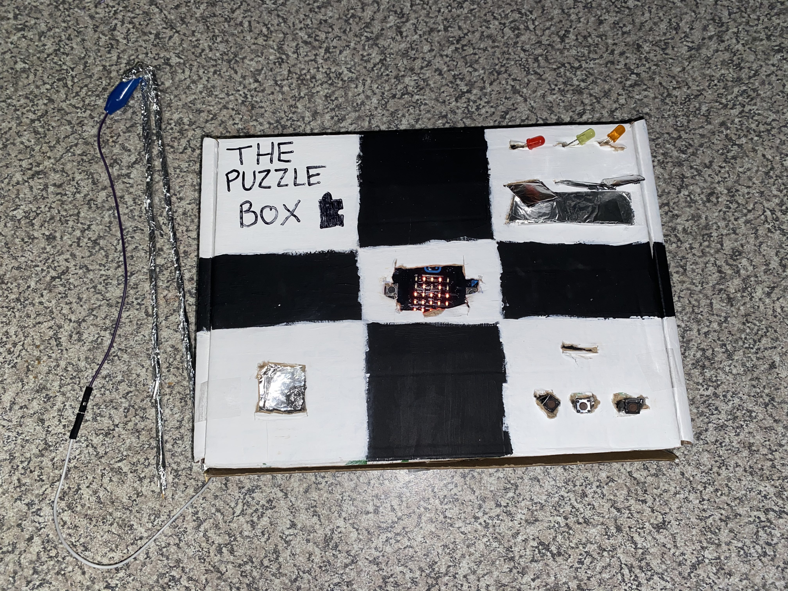
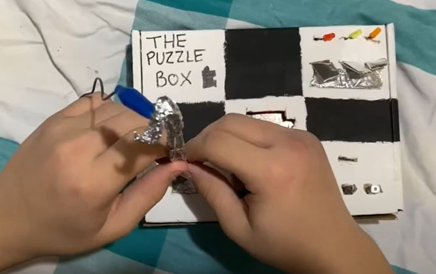
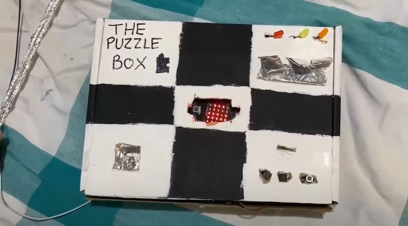

# The Puzzle Box
## Rebecca Harrison ##
## 1701QCA Making Interaction 2020 Final Project ##

#### Showcase Image ####

#### Project Description ####
The Puzzle Box is a checkered box that has 3 different puzzles for someone to test their skills. This project is open to range of people, such as someone who is new to puzzles and wants somewhere to start or someone looking for fun. The challenge: figuring out what button is what and still being able to solve the puzzles. When the puzzles are solved, await for your reward to be unlocked for you. 

#### Secondary Image ####

#### PROJECT VIDEO ####

### Journal ###

<!--- The following link will direct to your process and reflection journal, which will be held in the file `journal.md` in the folder called `journal`. This link should not be changed. --->
[Process and reflection journal](/journal/journal.md)
