# 1701QCA Final project journal: Rebecca Harrison

<!--- As for other assessments, fill out the following journal sections with information relevant to your project. --->

<!--- Markdown reference: https://guides.github.com/features/mastering-markdown/ --->

## Related projects ##

### Related project 1 ###
PuzzleBox

https://create.arduino.cc/projecthub/arduino/puzzlebox-c1f374?ref=search&ref_id=puzzle&offset=0

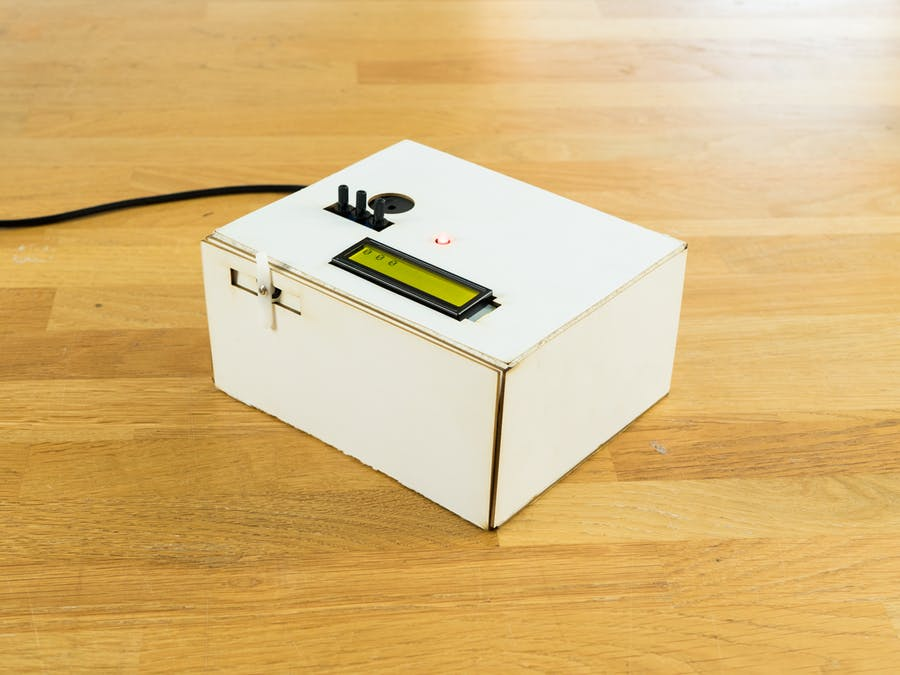

This project is related to mine because I would like the outcome of my game box to have a reward for solving the puzzle/problem. AS a result of this, this project is related to mine through the technology used and the function of said technology. For in both projects, a servo is used to unlock the box, revealing the reward for resolving the problem at hand. These servo’s horns would only be activated once the user completes or solves the problem through the use of lights, buttons, etc. to eventually activate the servo horns to activate and open. Therefore, this project is related to mine through its similarities of technology, function and concept. 

### Related project 2 ###
Electronic Puzzle Box uses only Discrete Components

https://hackaday.com/2014/05/14/electronic-puzzle-box-uses-only-discrete-components/

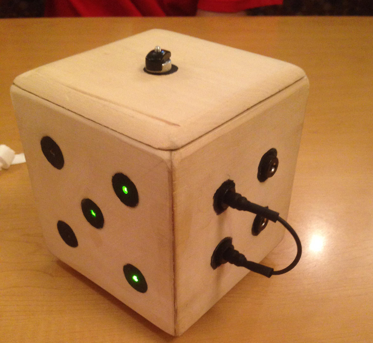

This project is related to mine through its concept of various puzzles for the user to solve in order to open the dice container. For my project, the user will be asked to accomplish various puzzles like obtaining a specific colour, all lights to be on or off, reaching zero or a certain number while each button adjusts in random variables. However, this project also uses the tilt function of the program, which would be cool to implement into my project as a problem to solve somehow. These lead this project to be related to mine through its concept, technology and fabrication.

### Related project 3 ###
"Bomb" Diffuse Game

https://ramenboii.weebly.com/vis-147a/final-project-bomb-diffuse-game

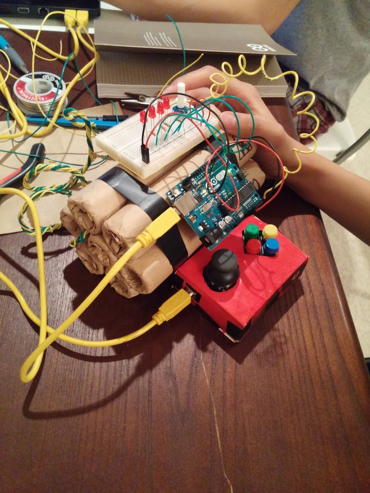

This project is related to mine through it’s materials, concept and code. These can be seen through the use of a separate breadbox from the mounting plate, LEDs, cardboard and paper. The cardboard and paper in this project help with the aesthetic of the game, while my project will use this combination to form a box and be decorated with paper to be aesthetically pleasing. While this project requires the user to disconnect wires to disarm, the concept and code are similar to my game box. They are similar through having a set timer to solve the problems before the box remains forever “locked”. As well as having the same concept of having to do something to get an outcome. For this project the outcome is to prevent the bomb blowing up, while my project sees a container to open up. These projects are led to be related together through material, function and code. 

### Related project 4 ###
Turning Lock Puzzle

https://create.arduino.cc/projecthub/krishnalalith/turning-lock-puzzle-356d56?ref=search&ref_id=puzzle&offset=4

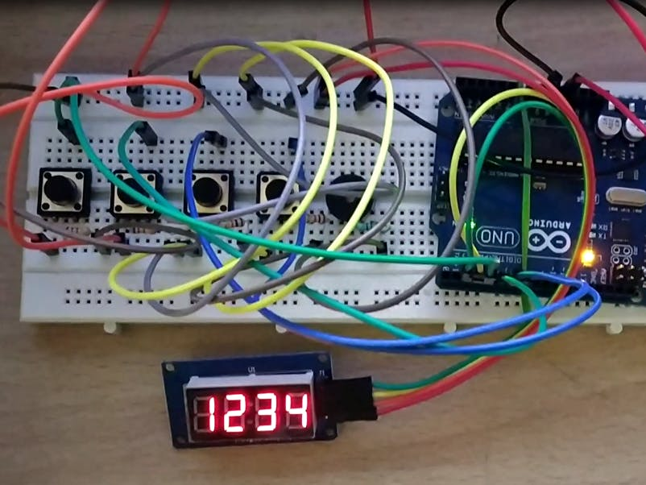

This project is related to mine due to the code used and the function that it leads to. In this project, when an individual digit is changed, the neighbours (left and right) of this digit are also changed. The function of this project sees that the user is required to change the numbers into the correct combination, with this project acting as a luggage lock. These are related to my project as I aimed to implement this type of number change into the game box, but with changing the surrounding numbers in various variable adjustments. As well as having this problem would take the user one step closer to solving the box and getting it open. As a result of this, these projects are related through concept, code and function of project.

### Related project 5 ###
Keep Talking and Nobody Explodes - Physical Edition

http://www.dillonlareau.com/projects/KTANE_physical

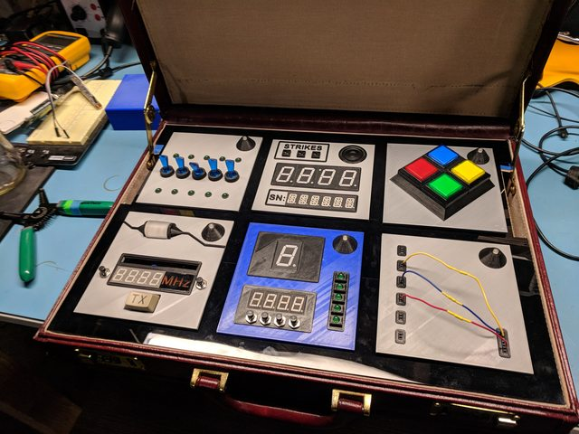

This project is related to mine as it gave inspiration to create my own project. These two projects are also related through fabrication of projects. For this project, there is a section of the ‘bomb’ that requires the user to use their memory with the implemented lights to disarm a section. However, for this project it uses more materials and technology than what I have access to. As a result of this, it is planned to use the LED’s and alfoil to develop my own version of a pattern for the user to memorise and replicate. In the end, these projects are related through concept and fabrication as a result of inspiration.

### Related project 6 ###
Interactive Toddler Music Box Toy

https://create.arduino.cc/projecthub/68284/interactive-toddler-music-box-toy-2c8dcf?ref=search&ref_id=box&offset=28

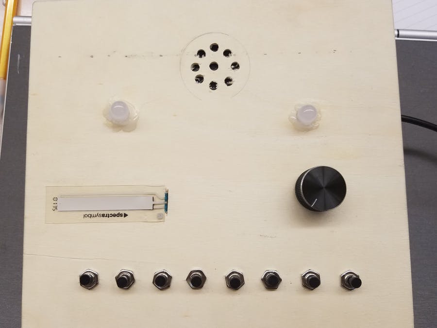

This project is related to mine through its fabrication. For starters, it is planned to design my project first with cardboard and paper to ensure the concept, technology and everything words correctly and accurately. From there, it is planned to put holes into the cardboard in order to have the LED and buttons accessible to the user ontop of the cardboard. This provides for the project to cover the wiring beneath the cardboard where it cannot be easily tangled. 

## Other research ##
<!--- Include here any other relevant research you have done. This might include identifying readings, tutorials, videos, technical documents, or other resources that have been helpful. For each particular source, add a comment or two about why it is relevant or what you have taken from it. You should include a reference or link to each of these resources. --->
### DIY Micro:bit Reaction Game ###

https://www.youtube.com/watch?v=217aTDpQda4

This video has is relevant to my project as it provides evidence that it is possible to create buttons with the use of alfoil. At the same time, it also provides a method of how to produce such a button by using alfoil.

### Foil Circuits ###

https://makecode.microbit.org/device/foil-circuits

From this tutorial, I have taken that if I run out of wires for my project it is possible to use aluminium foil to create new wires to use. This is relevant to my project as I will need to purchase more wires to connect everything. However, in the mean time while I await these wires to arrive, I can still test and build on my project by using these aluminium foil wires in the meantime. 

### Connecting An LED to the Micro:bit  ###

https://support.microbit.org/support/solutions/articles/19000101863-connecting-an-led-to-the-micro-bit

From this tutorial, I have taken that a breadboard is not completely necessary to connect an LED to a breadboard. From this tutorial, it is now known that the wires do not need to use a breadboard to still get the LED to light up. As a result of this, this tutorial is relevant to my project as I will be able to connect LEDS further apart from eachother without being attached to the breadboard. 

## Conceptual development ##

### Design intent ###
A game that intends for the user to improve their problem solving skills.

### Design ideation ###

### Design concept 1 ###
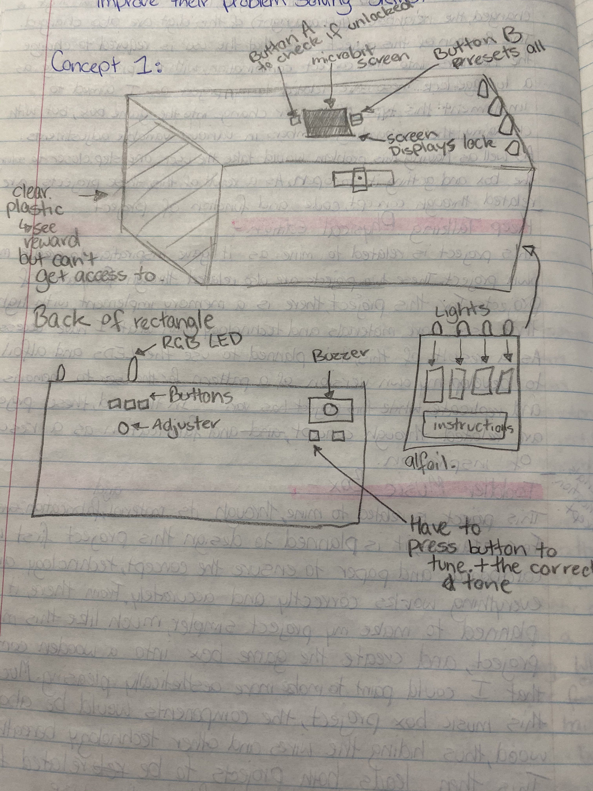

This concept attempts to use all the empty space around the rectangle box. Thus leading sections of the puzzle to be spaced out. When the user presses Button A, the microbit checks to see if each puzzle has been solved. If deemed that the user has, the servo horns will be activated and the user will have access to the reward that they can also see through the plastic on the side of the box. However, if deemed unsolved, the LED screen will show a locked symbol and the servo horns will remain deactivated. 

If the user chooses to press button B, all progress made on each puzzle will be reset. 

### Design concept 2 ###
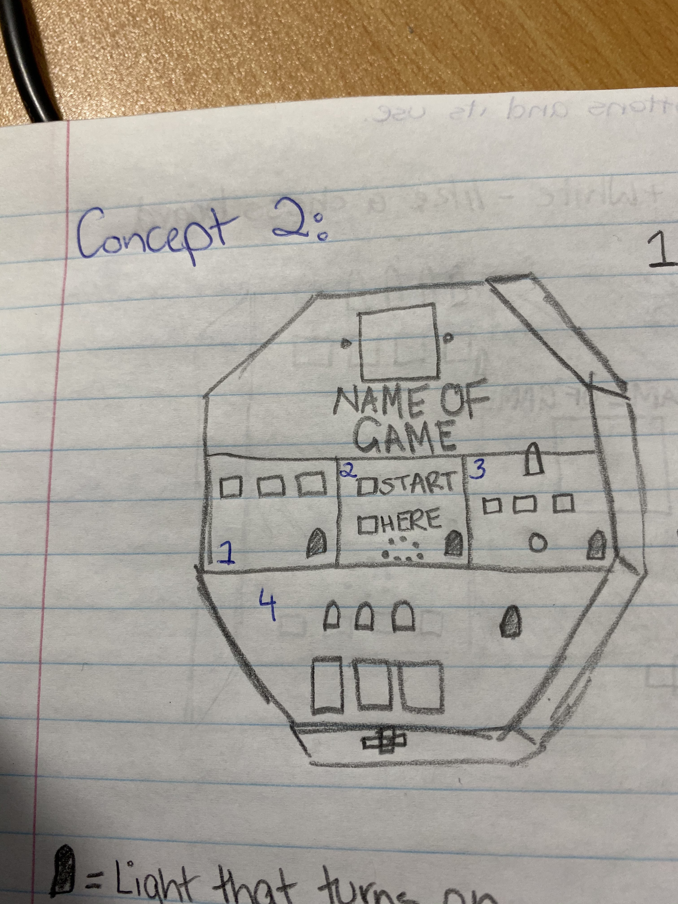

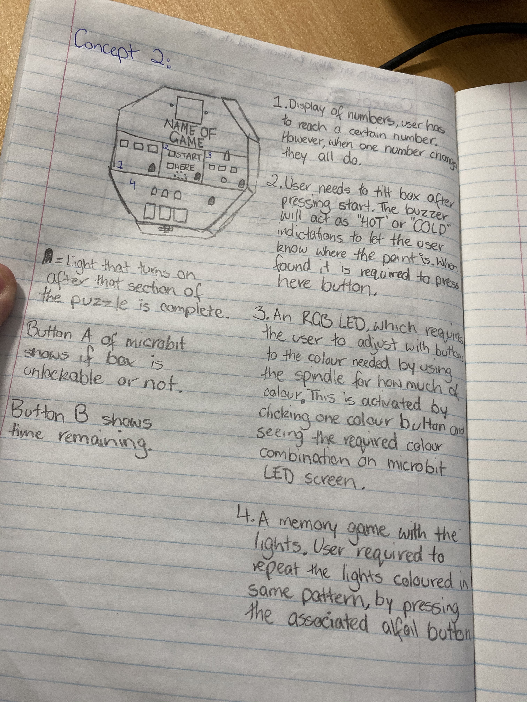

When all four lights are on, the user will be required to press Button A to double check. From there, if the microbit deems that the user has completed all puzzle stages, the servo horn will be activated and at the bottom of the hexogon, the compartment will open to reveal the reward inside. At the same time, the LED screen of the microbit will have the unlocked symbol present. If the microbit deems that the user hasn't complete all the stages, the LED screen will remain to show a locked symbol.

### Final design concept ###

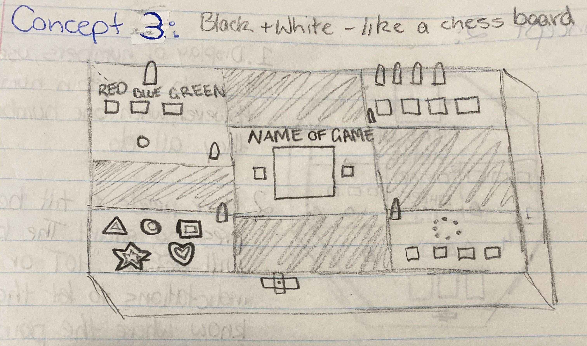

##### Interaction Scheme: 
In the middle is the micro bit screen with its button A and B on either side. If the user chooses to press button A, the program will check to see if all puzzles have been solved and if it should open the compartment being held up by the servo horns. On the LED screen will be a locked or unlocked symbol, depending on the outcome checked by the microbit. However, if the user chooses button B, the timer will be displayed. When this timer reaches zero, the buzzer will sound off as an alarm. Although if the user presses A and B buttons at the same time, all progress and timer will be reset.

The progress of the puzzles will be deemed through LED lights on the corner of each puzzle section. These will light up when the user finishes that section of puzzle.

In the top-let corner, this puzzle requires the user to adjust the RGB LED to a specific colour to solve the puzzle. This colour can be found across the micro bit screen the first time a button is clicked/pressed. From there, when the red button is clicked, the user will need to adjust the voltage with the spindle the amount of colour produced. This also occurs with the blue and green buttons, as the colours can only be adjusted one at a time. Only when the required colour is made will the puzzle be solved and the LED in the corner will turn on.

The puzzle in the top-right will play a pattern with the LEDs that require the user to repeat with the buttons below. The pattern shall begin when the user presses any one button. However, if the user gets the pattern wrong, the LED lights will replay the pattern from beginning for the user to memorise and replay. When the pattern has been replayed correctly will see the corner LED light up.

In the bottom-left, this puzzle resembles a type of operation game. The user is required to play the shapes inside its container without touching the outer-rim, which is covered in alfoil. Whether or not the shapes are in its spot will also be determined by checking if anything is on top of the alfoil at the base of the container. From there, and all the shapes are in the correct spot, the corner LED will turn on.

For the final puzzle in the bottom-right, a certain tone will play from the buzzer. The user will be required to press the correct button that holds the same tune. This will occur two times to become solved and before the corner LED can be turned on. Although, if the user chooses the wrong tone, the buzzer will play the tone twice, pause, then play a new tone for the user to guess. This whole puzzle is initiated by clicking one of the buttons before the first tone can be played. 

When all four corner LEDs are on and the user has pressed button A, the servo horns will activate. This leads to the compartment to open and for the user to collect their reward inside the game box. 

##### Technical Functionality:
Everything is spread out within the box to fill in the white space of the box. At the same time, this assists with the aesthetic of the game. As  a result of this, the LEDs and buttons will more than likely not be connected to the breadbox directly, but be more connected through wires onto the breadbox. Also, this will see the microbit and breadbox not connected to the mounting plate.

The program within the micro bit will be constantly checking to see if any of the corner LEDs are on. Thus the program will be constantly checking if it should unlock the servo horns.

##### Fabrication Approach:
The approach to fabricating this project shall see each puzzle being built one by one. However, before this begins, the servo, micro bit buttons, timer and connection to the corner LEDs should be created first to ensure these work correctly. From there, the focus would be on the puzzles on each corner while knowing the base foundation works. When a puzzle has been made, it will be tested with the foundation to assure that it all still works appropriately before continuing to the next puzzle. When all puzzles are done, the next approach will see the creation of its box container that all these wires will live in. While also checking that nothing will come loose within the box that may disconnect the puzzles or wiring.

##### Materials to Be used: 
In order to create the final project, the materials needed to build consist of alfoil to create buttons to add to the puzzle and as a border. Other materials consist of cardboard to form and make the box that holds the technology. As well as paper to add extra details to the box such as instructions. 

##### Aesthetic:
The plan for the project sees the top painted in black and white checkers, like chess. The white checkers will hold the puzzle pieces, while the black checkers will just act as a holder for empty space. The door of the compartment will also be white, while the rest of the sides of the box will also be black. The aim of this decision hopes to perceive the box to the user as a problem-solving game, like chess is such  a game like that. 

### Interaction flowchart ###

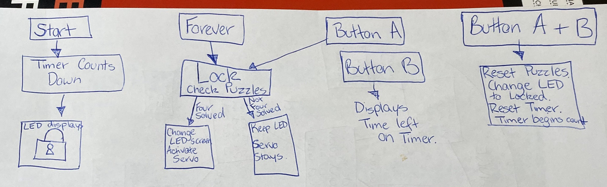

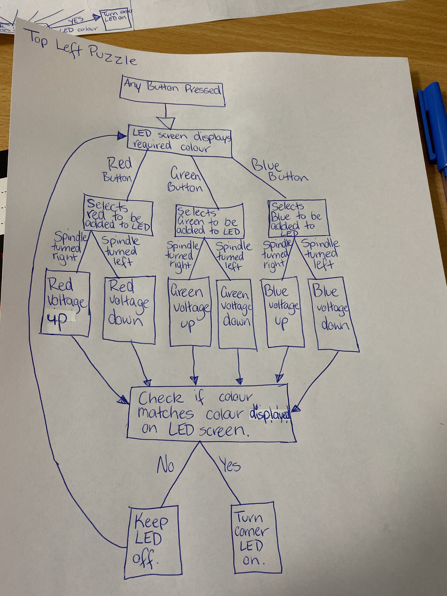

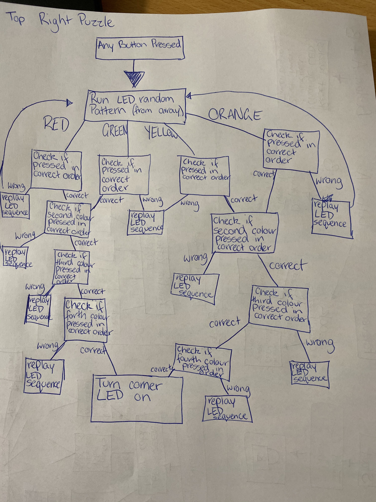

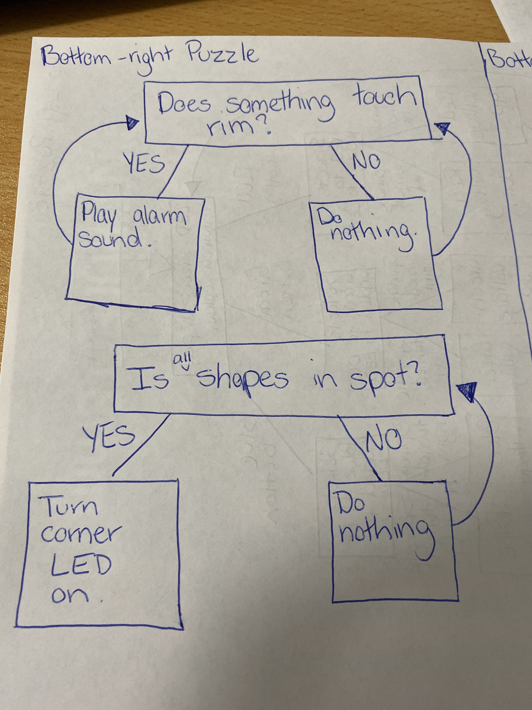

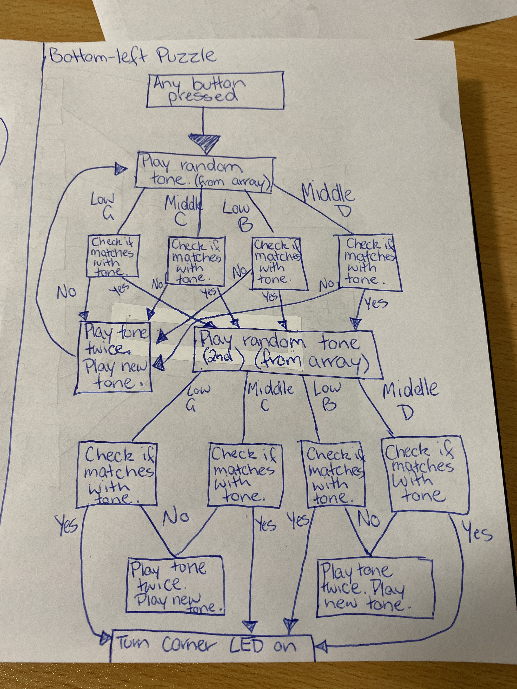

## Process documentation ##
<!--- In this section, include text and images (and potentially links to video) that represent the development of your project including sources you've found (URLs and written references), choices you've made, sketches you've done, iterations completed, materials you've investigated, and code samples. Use the markdown reference for help in formatting the material.

<!---This should have quite a lot of information! It will likely include most of the process documentation from assessment 2 which can be copied and pasted here. --->

<!--Use subheadings to structure this information. See https://guides.github.com/features/mastering-markdown/ for details of how to insert subheadings.

<!---There will likely by a dozen or so images of the project under construction. The images should help explain why you've made the choices you've made as well as what you have done. --->

### Prototype of Project ###
The whole progress began by adding the extension for servo into the microbit code. From there, it began by designing a timer to be counting down to 0, whilst testing the servo to be working. In order to do this, I had the timer count down from 15 seconds and have the servo react when reaching zero. However, upon the very first test, the servo struggled to turn when reaching 0. Thankfully, at least the wires connected were correct, which was discovered through the servo motor still vibrating. This problematic code can be seen beneath:

Instead of fixing up this code, I moved on to beginning the prototype for the startup of the puzzle game box. This progress began by creating each puzzle corner's variable (labelled 1 through to 4) to be accessible when user presses button A to check if it can be unlocked. This was tested by setting the variable to "1", in other words "solved", by having this change the variable when button A and B are pressed together. After pressing the two buttons together, the program was checked by pressing A to check if the variables would work and unlock the compartment. The result of setting this startup leaves it easy to add the code into the end of solving each puzzles to easily turn on their corner LED's and already have the connection to button A and the compartment ready. 

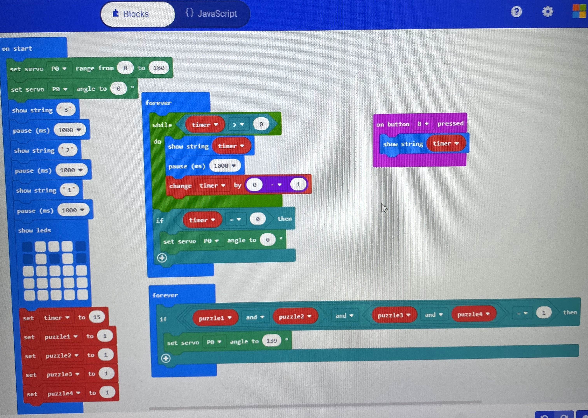

After setting that up, I revisited the previous timer and servo code with new eyes to discover that the code was wrong. The fixed code can be seen below, along with a youtube video link to see the code in action: 

VIDEO LINK: https://youtu.be/_ln-1XZwHl0

The code was fixed to get the servo horns to move when the timer reached zero. After this was completed, this code could be copied into the startup code I had already started, thus making button B set up for the timer. 

After copying the code into the startup, I finished the rest of the necessarities. This included setting the button A and B pressed together to reset the puzzles LED to unsolved, timer to begin again and to restart the countdown. Also made the timer countdown from 5 minutes, with the intentions of coming back to include the alarm buzzer sounds at a later time.

The next step began Puzzle 1 prototype construction.
The whole process began by following the set-up steps of exercise 10, but with swapping the placement of where the LED and buttons are. However, when adding the code previously made to test the new placement of technology, it did not operate. The new placement of technology can be seen below:

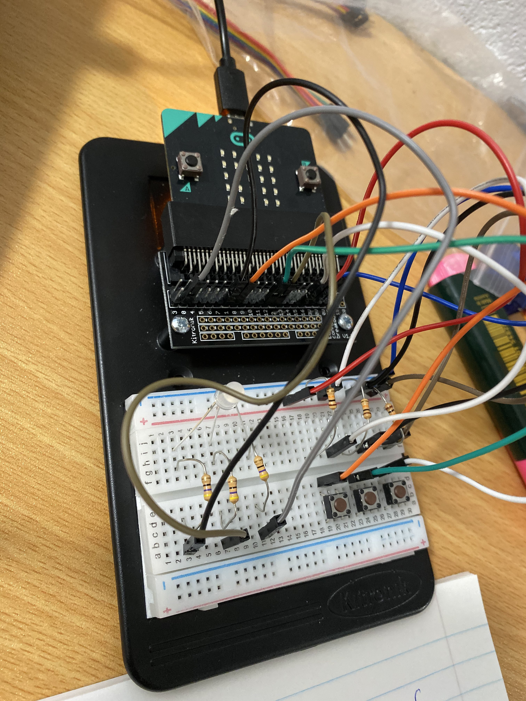

After this saddening discovery, the actual steps were taken and the technology got moved back to their old positions. From there, the previously made code was again tested and saw success of the program. The following steps see manipulation of this exercise to add the spindle and suit the puzzle more. This meant the attempt of combining exercise 10 and 3 together. This combination is below:

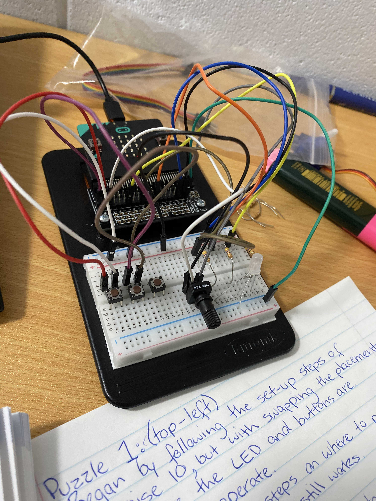

However, it did not lead to any results other than the LED randomly flashing. Through, as a quick resolution, the microbit and laptop were unplugged from eachother, the RGB LED was pushed down and both the laptop and microbit were replugged. This process saw the red of the LED shine brightly, but did nothing when the button was pressed or the spindle was turned. Also, the randomly flashing of the LED was not resolved either.

After further studying the javascript of exercise 10, I attempt to write the code I want. I had then turned that newly made javascript into blocks and tested that:

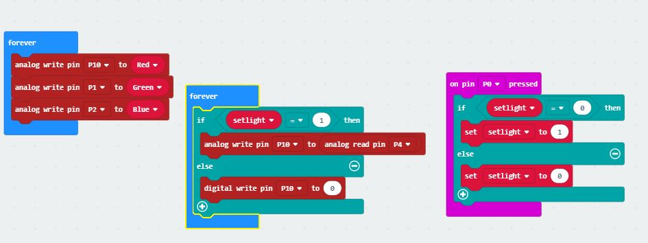

Although, no progress was made as the previously mentioned errors were still occuring. With the exception of when the button was pressed, the red light flickered a little before it went back to its previous state. 

The next test was to check if the spindle was actually working amongst all the wires and other technology components. This was undertaken by replacing the RGB light with a regular red LED. The result of this saw the LED instantly turn on and do what the RGB light was previously doing. 

To accurately test the spindle, I placed the previously made exercise 3 code into the microbit. Even when this was finished transferring, the red LED still instantly turned on. The button no longer worked, (though it was programmed to another pin within the previously made code). When the spindle was turned clockwise, nothing happened until it reached the very end of its spin. The LED screen produced a LED screen error (seen below), yet did not dim the red LED at all. 

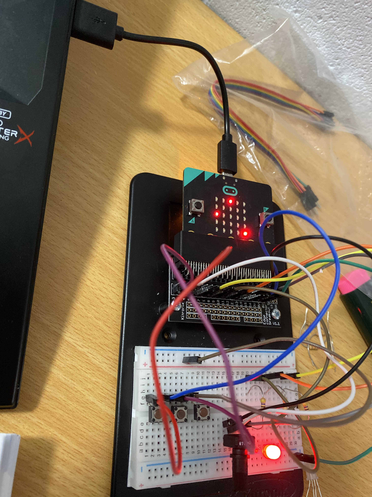

I reset the exercise 3 code, replacing it with the previous code I was working on that saw the combination of 10 and 3. From there, I edited the javascript and got rid of the flashing LED errors. As a result of this, the button no longer works, the RGB (replaced the red LED) light remained on and the spindle error still appeared when turning it all the way clockwise. 

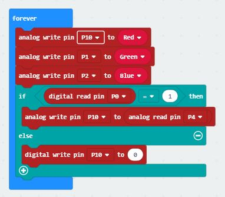

After long fiddling with the javascript and block code, going back and forth (below is a photo of how back and forth this went) between what might work or not, I finally got the red on the RGB LED to turn on and off with the spindle. Although, to turn the light on and off, the spindle had to be turned all the way anti-clockwise to work. Even the button assisted by turning the red RGB LED to turn on and off. Now the next step is to try to attempt to get this to work for the other two colours. Below sees the code that allowed the red RGB LED to work, and the video that shows the code in action.

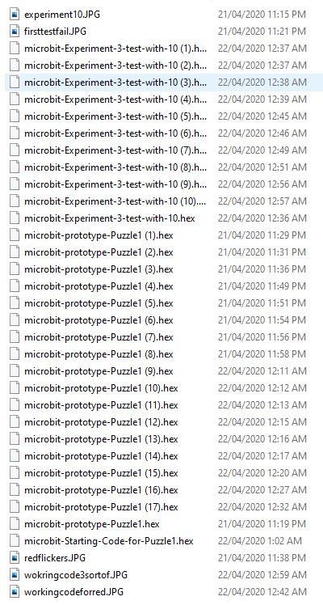

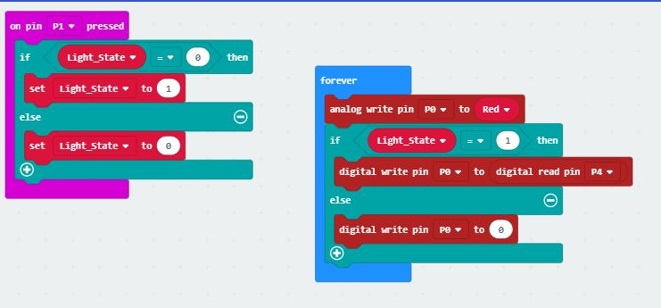

VIDEO LINK: https://youtu.be/yvCPzAfJxvo

The code of the red RGB LED was copied and replaced with the functions for the blue LED to appear. This correctly worked, just like the red one. However, the green did decide to make an unannounced appearance without being told to through code. This is an error I couldn't figure out. Also, due to not having enough wires at the time of this testing, I had to test the green LED through pressing button A. The steps taken to copy the red LED code were taken again and adjusted to fit the green LED. Below is a test of all three colours on video. Obviously it is a prototype, so in the future, the extra colour that has appeared will be solved easily. For the meantime, the puzzle can work as intended. 

Final Code: 
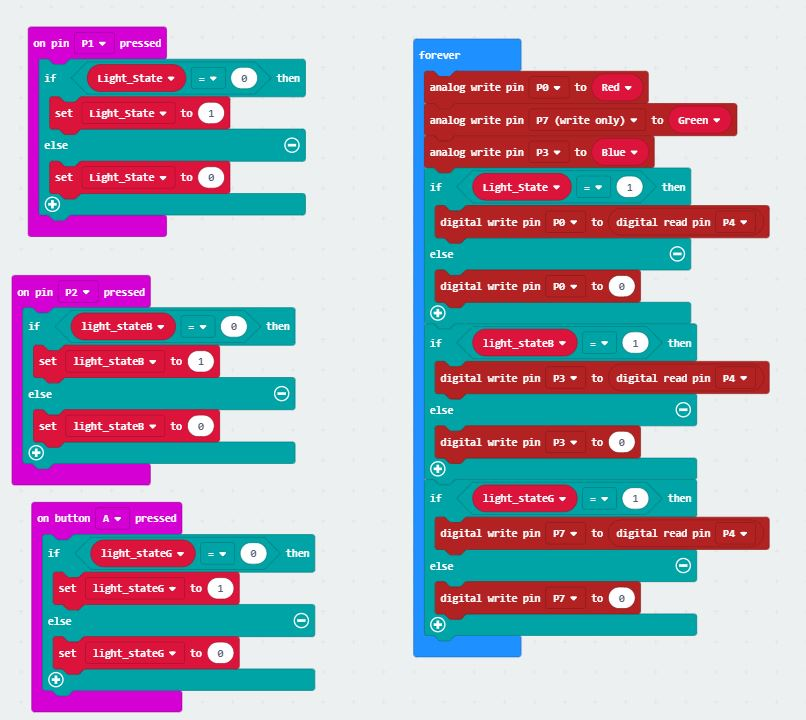

VIDEO LINK: https://youtu.be/ETBmdsR4X_Y

The next step of physical experimentation begins with puzzle 2. 
This begins with placing onto the breadboard two different lights that can be programmed within the microbit to turn on in a pattern. For the meantime, I attempted to get the microbit to have the lights change between the two first and unlock from there. I intially attempted to add arrays into this, but I had to make sure that the concept idea of having a pattern that the user needs to repeat would work. As a result, the code below is what was tried first, followed by the video of this code in action.

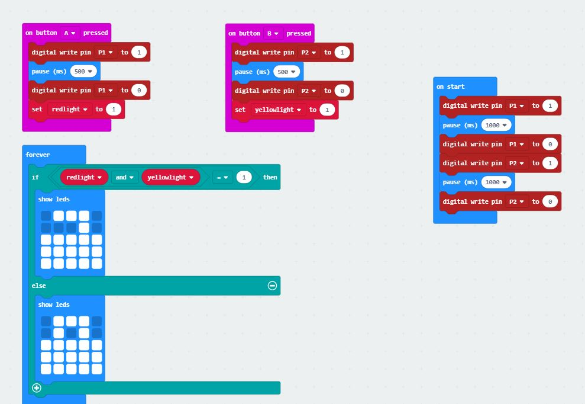

VIDEO LINK: https://youtu.be/OwOoXOTEbdc

In order to make sure that this puzzle could work to the concept idea at hand, the next step sees the fabrication of aluminium foil being used as a button for the microbit. With this aluminium foil, I had cut toliet paper rolls into pieces to act as a motion of a button - where one pushes down and it pushes back up. As a result of this, the code had to be adjusted from pressing button A and B to pressing a pin that I hoped would work with pressing toliet paper roll onto a non-stable sticktaped strip of aluminium foil on my desk. The code chosen was:

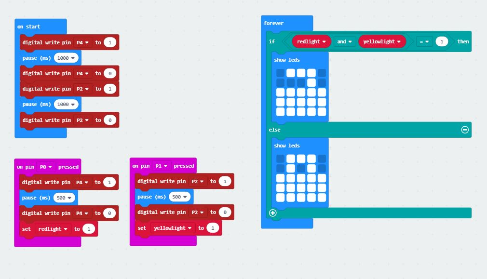

At first, the test saw only one toliet paper roll button tested, to ensure that it could work. If it didn't I would have to rethink what else could be substituted as a make-shift button for this project. When it did, the second pressed button was added and below can see the outcome of this decision.

VIDEO LINK: https://youtu.be/qUDkW-_eqpw

As a result of these two puzzles being created, even as prototypes to the final project, it proves that this whole project is completely possible. With the use of aluminium foil, it is possible to create a border for a makeshift operation, while the buzzer puzzle is similar to puzzle 1. 

Even the plan to include the entire game inside the microbit box, where it is small, compact and easily accessible. It can be deemed as an appropriate container to maintain the project.

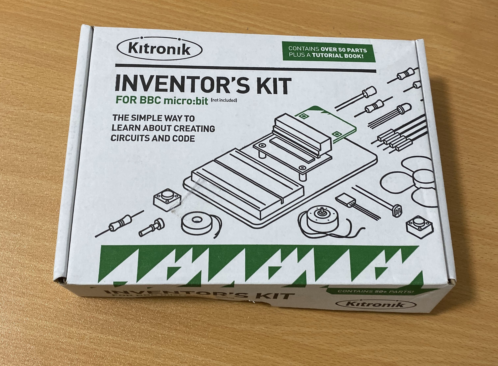

### Final Project Development ###
The beginning of making the final project begins with painting the inventor's microbit box with checkers of black and white. It all started with checking cupboards within the house for paint and brushes. What came up was finding black body paint and white make up paint, as a result of halloween. I outlined the areas of which were being painted with a white pencil on the cardboard box to attempt to stay within those lines. First up, I was painting the box in black the checkers on top to cover the words and on the surrounding sides and bottom of box. However, I did not colour in the front sideas this would be the area of where the servo will work and I have yet to figure out how to make it work appropriatly, so I decided not to paint this section.

The next step sees the use of the white makeup paint in the bottom right corner. However, after waiting 5 minutes there was no sign of this paint type drying in order to coat it again to ensure that the words on the box would disappear. As well as having no sign of it ever going to dry in order to continue. This lead to having to grab a tissue and wipe the white 'paint' off the box and going out to the nearest newsagency and buying new white paint. With this new paint, I painted and each of the checkered boxes, waited it for to dry before repainting over it. This process was repeated until the words underneath the paint are no longer seen. The result of which the box currently stands at can be seen below:

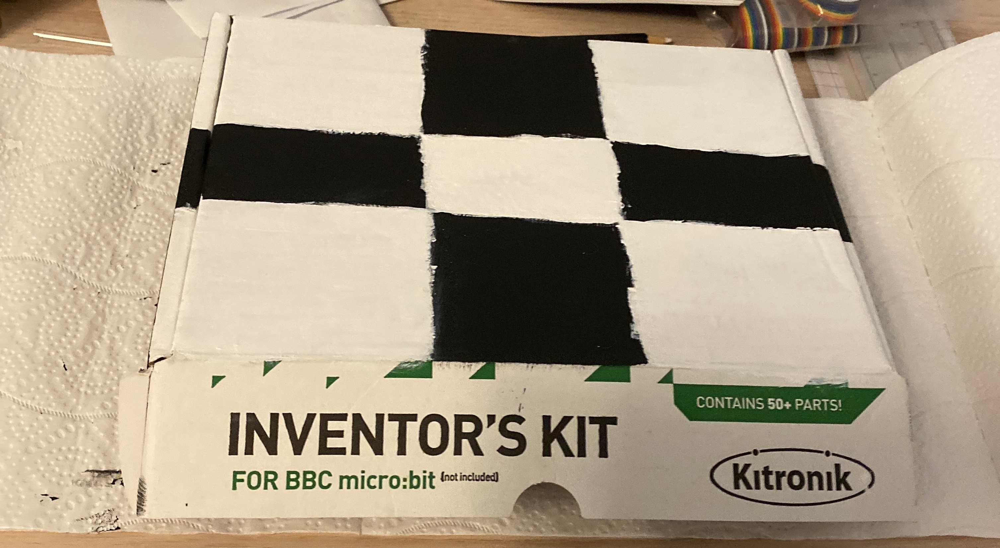

#### Puzzle 2 ####
From there, I remade Puzzle 2 onto the breadboard and program into the microbit from following the above information of what I did correct and wrong. I had also disconnected the breadboard from the mounting plate and unscrewed the edge connector breakout board. This breadboard had the bottom sticky taped together so the pieces wouldn't fall out or be disconnected, before being blu-tacked onto a yellow piece of cardboard paper. 

From there, I thought of ways of how to get these LEDs to be able to be put through the cardboard without having to be connected to the breadboard - of which other wires are going to be connected to for other puzzles. This led to trialling connecting the resistor, male-to-male jumper wires and the LED together with sticky tape to position the ends to be together. However, this did not work and I really struggled to ensure that the ends were actually touching before taping them together. When undoing the sticky tape, I replaced it with alfoil to have the wires at least touch this and share the current through this to the other wire end. And to ensure that the alfoil stays there, I sticky taped the alfoil to stay with the wire. When this was tested, it proved to work as intended.

https://www.youtube.com/watch?v=43eV9AC2dpE&feature=youtu.be

Knowing that this worked, I also made it for an orange and green LED and added this to the breadboard. With the intentions of having all four LED's being used with the microbit and for Puzzle 2's memory game. However, when I moved to the next stage of adding the buttons in, the microbit only allowed 3 pin input's instead of the desired four. So the green LED is removed (planned to readd later to be acting as the indicator that this puzzle is complete). 
This time, I have aligator clips to connect the breadboard and microbit to the new touch buttons and ground, instead of having to sticky tape them together and hope that they remain intact. I also tested the new touch buttons by having all three different buttons connected. One of the buttons is a piece of toliet roll cut up and covered in alfoil, another is a piece of toliet roll cut up and only has alfoil on one side and the last button is just a loose piece of alfoil.
This has been done to decide would be a better suit to puzzle 2 and the best acting touch button that would work ontop of the cardboard box. 

https://youtu.be/vsfhhKasv8I

To end puzzle 2, I added a function into the code. The use of this function allows the microbit to turn on, but not activate the sequence of LED lights until the user chooses to start the puzzle - by pressing any button, and having that button lead to calling the function to play. This working code can be seen below:

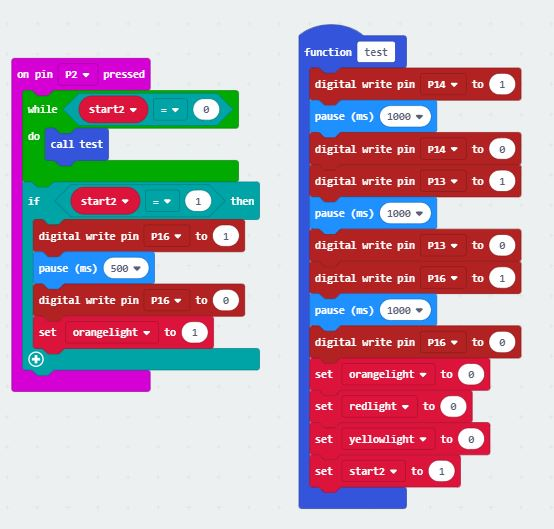

#### Puzzle 1 ####
Began by relocating the prototype from Journal 2 in order to recreate Puzzle 1 onto the same breadboard as where Puzzle2's wires are currently connected to. 
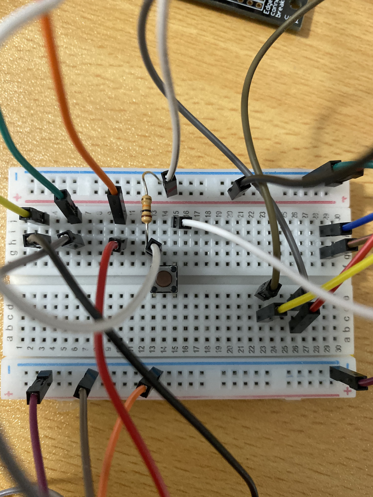

This process started with testing a button switch to see if it would still complete its job with all the wires already plugged in. Thankfully, it worked and allowed an easy transition from the breadboard to having the button's wires extended and connected together with alfoil and sticky tape to have it stay together. 

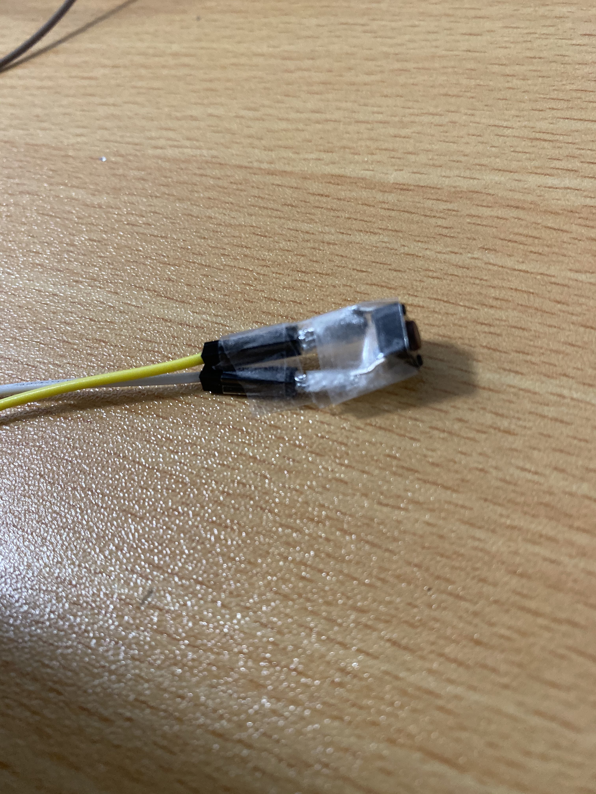

The above process was also repeated two more times to make three useable buttons for puzzle 1 before being placed in position onto the breadboard. After they were placed, I had conducted a test with the microbit that focused solely on making sure that each button worked. The below code was tested, and turned out successful.

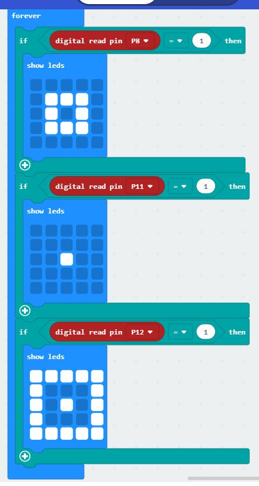

Following the success of the buttons leads to the implementation of the RGB LED on the breadboard and into the microbit code. In order to keep the puzzles sectioned together and have enough space for other puzzles if needed, the placement of the wires of the LED were planned out. This can be seen below, with the squares being the placement of the switch buttons and the x's being where the wires for LED are planned to go. 

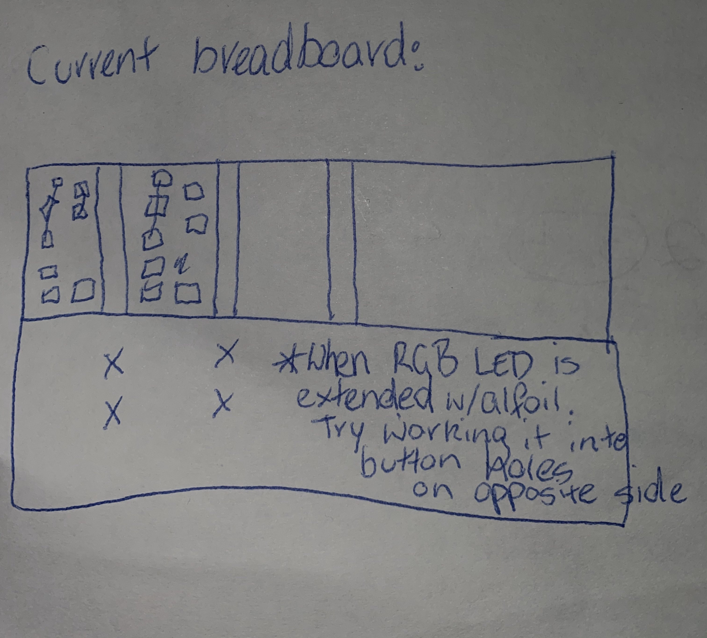

From there, the next step sees having the RGB LED extended in order to have it go through the lid of the puzzle box. This extension sees sticky tape and aluminium foil to connect the resistors and wires together in an attempt to be stable. 

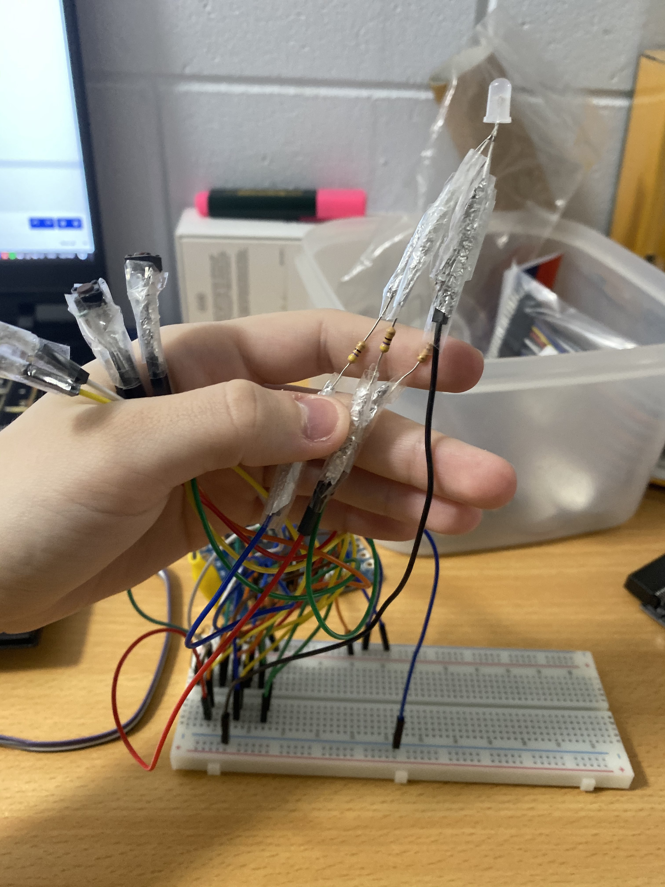

Once this production is complete, the LED and buttons were tested together to ensure that nothing had broken or come apart in the process. In order to test this, the code from experiment 10 in the microbit kit was tested and succeeded. This then leads to the final incorporation of puzzle 1, adding the finger spindle and potentiometer.

At this point, things were looking to be a success and I had written a plan of what to do for the rest of the day:
- connect spindle to microbit/ breadboard
- get correct code
- test
- extend the spindle (to later go above the box)
- test everything is still connected and working
- connect wires to microbit with puzzle 2
- combine both code together
- add startup code (from prototype) into above combination
- add green LEDs?

However, things did not go to plan at all. It was a real struggle to successfully get the spindle involved with the LED and buttons and working appropriately. Another problem whilst going through this sees wires being disconnected from each other, leading to more envolvement of sticky tape to restrain the wires from moving away from eachother. 

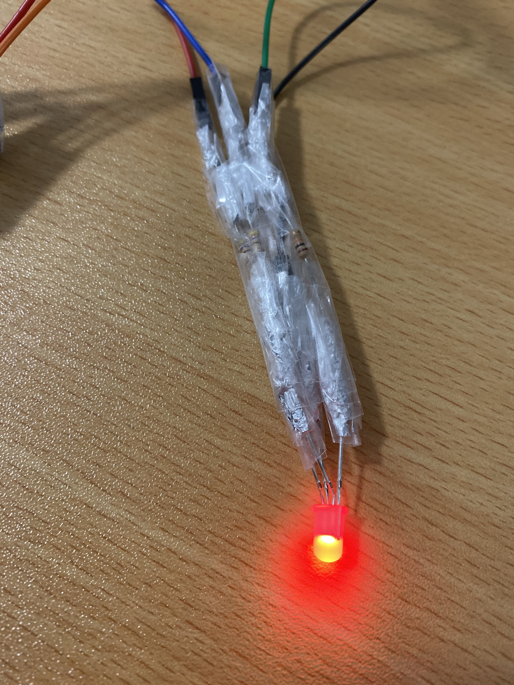

Yet another problem sees even the littlest of movement out of position from the spindler/potentiometer cuts out the power to the LED or flickers it. This gave false hope at first that I had gotten some progress and was getting closer to getting the LED to dim or brighter, however this was not the case at all. From 4.31pm to 6.30pm, saw this problem being tackled without any progress.

VIDEO LINK: 

It was decided by 6.30pm to start the code over again and to try a different approach. So the first approach took inspiration from the experiment 10 and attempted to incorporate the spindle and have the voltage change according to the analogRead produced. Though, this was a fail. The new attempt sees the below code, that was restarted, to finally have feedback and progress of having the spindle work for this puzzle. However, it only worked a little bit by changing the brightness of colour, although it is a start in progressing to the final. Unfortunately, with this feedback, only one colour is activated and changed when first pressed with the button. At the same time, no other colour can mix or can the first pressed colour be turned off with the button. 

Code that gave feedback:
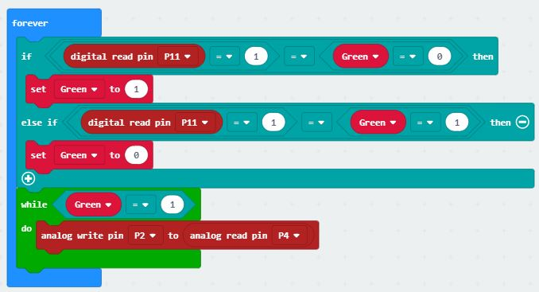

VIDEO LINK:

After a lot of back-and-forth in an attempt to resolve the above issues, I couldn't get the code, spindle or LED to work together or at least to meet the planned intentions. As a result of this, I have come up with a new gameplan for puzzle1: 

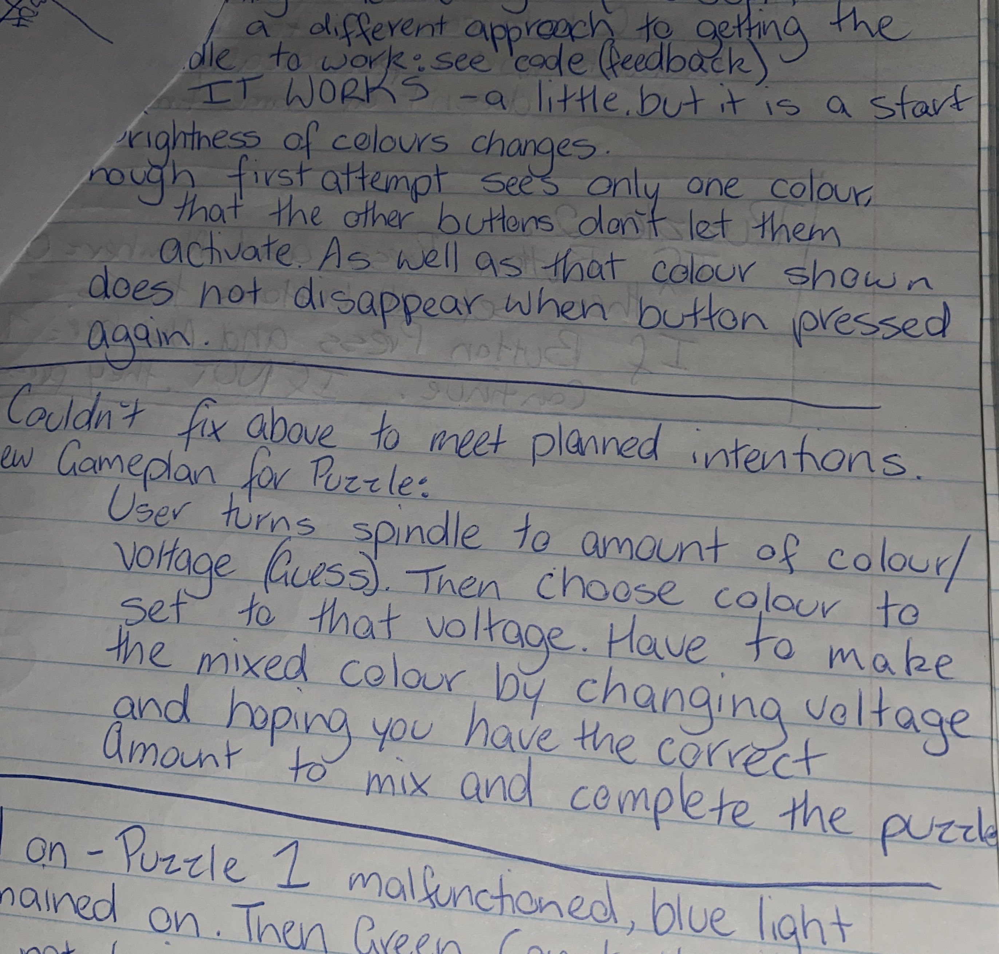

This new gameplan was proving to be a success and was heading in the right direction. THe proof of a good start for this can be seen in the video below.

VIEDO LINK: 

Then everything fell apart after that. The wires taped together for the LED had pushed the alfoil together and had the LED malfunctioning, as in only remaining on one colour and dimming from there. Which is what I had wanted previously before the new game plan, but still was unable to change to another colour to dim or brighten that. As a result of this, I had cut the wires out of that sticky tape to put new alfoil on the wires and separate them with a lot of space. After this was finished, a button had become disconnected from the bottom of the switch. This took the most time in attempting to get the button back together in working condition, because I was trying to wrap the alfoil and wire together in a ball. Though, the switch kept escaping and breaking through the alfoil due to the curving of the end legs. 

After setting these all back up, I had tested the current state of puzzle 1. The results were chaotic. It began with the blue light shining through the LED without having touched any buttons. But when I picked up the RGB LED from sitting on the table, it had changed to a high green colour. At least the spindle was attached, as it was constantly dimming the LED light when it switched between the blue and green on where it was held. During all this, not once did the red LED appear.

The fact that I had spent so much time on the above in attempts to get the spindle to work with the code, I had decided to move on. The plan was to see if I had any more ideas on how to approach and tackle puzzle 1 after completing other pieces of work. As well as if I could come up with any other kind of puzzle that bests suits the material and wires that I currently have. 

## Final code ##

<!--- Include here screenshots of the final code you used in the project if it is done with block coding. If you have used javascript, micropython, C, or other code, include it as text formatted as code using a series of three backticks ` before and after the code block. See https://guides.github.com/features/mastering-markdown/ for more information about that formatting. --->

## Design process discussion ##
<!--- Discuss your process used in this project, particularly with reference to aspects of the Double Diamond design methodology or other relevant design process. --->
The design process all began by being bored within the house whilst in social distancing and quarantine rules are put in place. As a result, taking from experience the discover aspect of the Double Diamond began by brainstorming ideas that could help in these troubling times. A few ideas consisted of asking family members how would they like to keep occupied within this time. These answers came through as reading, gaming or watching television quite frequently. As a result of this, initally the design project was planned to be a self-turning machine for books, so you would just press a button and the technology would turn your page for you. However, as a result of the define phase of the Double Diamond, this idea of a project didn't help to tackle the idea of keeping active or occupying oneself physically. 

This lead to having to come up with a whole new design intent and design concept. After some time looking over the notes I had gathered, I had come up with the idea of creating something that could keep one active and test out current skills whilst possibly improving them. This lead to the idea of board games that require a user to participate, think and possibly even communicate with others, if possible and depending on the game. 

From there, the develop stage saw various versions of board games that could keep one activated. Some took inspiration from the 'Bop It' game where reaction skills are tested, or having to connect similar colours together without crossing like 'Flow Free' but a realistic verison. Another good concept took inspiration from the 'Keep talking and nobody explodes' video game, where it sees two people working together to solve problems on a bomb within the time limit. However, due to restrictions on social distancing and rules needing to be followed, it was required that I had to develop an concept idea that saw problems or puzzles solved by oneself. This is where the Puzzle Game Box came about. As it takes into consideration that people might not have access to other people, thus allowing oneself to test their own problem solving skills on the Game Box. 

During this develop state of the Double Diamond, I had to make sure that each puzzle was different. In order to ensure that they were different and I wasn't being biased, I had to ask surrounding family members for their thoughts. At the same time, I enquired if there was any time of puzzle/game that they would be interested in playing if they were to play this Puzzle Game Box. Such feedback sees a measuring game, where the user would have to put specific blocks onto the box to acquire the desired weight without knowing how much a block weighs in order to solve. Another feedback sees somesort of rendition/updated version of 'Operation', which I have taken into account. 

The next step of the design process sees the delivery of ideas, testing and discovering how it all works together. For my design process, this was accomplished through creating the prototypes of my puzzle ideas. As a result of this, it is discovered that I will require more wires in order to connect everything together, thus I had to look elsewhere on how to fill this void. This research lead to discovering that I could still produce the puzzles with the use of aluminium foil to create buttons and connect wires when done correctly. Although, during this delivery stage of the Double Diamond, trial and error takes a big aspect of this stage. As without trial and error, there is no further development in the project and you cover all bases, such as any type of user input that might be used that has not been planned for. 

## CONTINUE HERE ##

## Reflection ##

<!--- Describe the parts of your project you felt were most successful and the parts that could have done with improvement, whether in terms of outcome, process, or understanding.

What techniques, approaches, skills, or information did you find useful from other sources (such as the related projects you identified earlier)?

What parts of your project do you feel are novel. This is IMPORTANT to help justify a key component of the assessment rubric.

What might be an interesting extension of this project? In what other contexts might this project be used? --->
